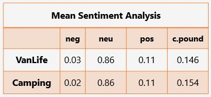
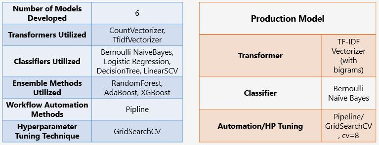

---
# Project 3 :  Web APIs & NLP 
---
## Subreddit Submission Pulls      

#### Ryan McDonald, General Assembly 

---
### Problem Statement
Aprils Fools' Day 2021: In the spirt of tomfoolery, another year has come and we've been tasked with the development of this years hijinks.  r/sinkorswim will be developed to frustrate users, and, hopefully, bring a smile to many more.  We are asked to perform two tasks:

   1. For two subreddits (starting with r/VanLife and r/camping), use Natural Language Processing to train a classifier Model on which subreddit a given post came from. 
   
   2. If the NLP Model doesn't outperform the Baseline Model or our own determined 80% accuracy performance metric, the majority subreddit will remain, and the other will be disabled. 
       * If a model cannot accurately predict which posts come from which subreddit, it's assumed the two subreddits are too closely related, and thus, unnecessary. 
       * If the model outperforms the baseline model or our determined performance metric, there is enough unique substance in each subreddit for them both to remain.
        
###### $_{1}$https://www.oberlo.com/blog/reddit-statistics
###### $_{1}$https://en.wikipedia.org/wiki/Reddit

 ---
## Executive Summary
**After intensive review, EDA, and preprocessing we were able to develop a classification model that could effectively determine whether or not two different subreddits were too closey related to each other. The model was further validated on several random sets of subreddit communities with excellent results.**
   
   -  This 'bot', r/sinkorswim will be launched onto the Reddit site for April Fools' 2021 to frustrated users, as well as create a buzz around our brand (Reddit). 
        
        -  For our Production Model, TF-IDF Vertorization and Bernoulli Naive Bayes binary classification was proven most effective for our modeling needs. We utilitized pipeline automation and gridsearching to test 96 different models iterations, narrowing in on our most effective hyperparameters. Aisde from our production model, between 5 other models we fit a total of 8,864 hyperparameter combinations in an attempt to out-perform our Production Model. 
        
        - The production model not only showed our best results, but with a quick runtime, can effectively be released onto the site without bogging the system down and affecting user experience (more than we intentially want to).
        
**As an added bonus to users, a graphical user interface was developed to allow them an opportunity to test the predictor built into the Production Model. A user will type in the title of the submission they wish to post, and the predictor will tell them which of two subreddits tested the post should go to.**

 
           
---
### Data Description
Data utilized for the project analysis was obtained through use of the Pushshift API by scrapping the Reddit website and pulling in subreddit title information. 

Dataset contains 2 columns.  One describing the r/subreddit (object/class) of origin, and the other, title data (object) from many posts withing the r/subreddit. There are two datasets utilized throughout modeling.  One with 8000 rows of original, unchanged title data. And, the other, containing 6371 rows of sentence-tokenized title data.

**Data Dictionary created for datasets utilized in this analysis**

| Column Name     | Data Type | Description                                       |
|-----------------|-----------|---------------------------------------------------|
| subreddit             | object     | subreddit origin name (class)                               |
| title             | object     | title of subreddit submission                     |

 
**The following databases were utilized in analysis:**

| Database Utilized            | Features Within Database                                         |
|------------------------------|------------------------------------------------------------------|
| Pandas                       |                                                                  |
| Numpy                        |                                                                  |
| matplotlib                   | pyplot                                                           |
| pickle                       |                                                                  |
| nltk - tokenize              | sent-tokenizer, Regexp                                           |
| nltk - sentiment             | SetimentIntensityAnalyzer                                        |
| time                         |                                                                  |
| xgboost                      | XGBClassifier                                                    |
| SKLearn - Model Selection    | train_test_split, GridSearchCV, corr_val_score                   |
| SKLearn - Pipeline           | Pipeline                                                         |
| SKLearn - Naive-bayes        | MultinomialNB, BernoulliNB                                       |
| SKLearn - Linear Model       | LogisticRegression, LogisticRegressionCV                         |
| SKLearn - Feature Extraction | CountVectorizer, TfidfVectorizer                                 |
| SKLearn - Ensemble           | RandomForestClassifier, ExtraTreesClassifier, AdaBoostClassifier |
| SKLearn - Tree               | export_text, DecisionTreeClassifier, plot_tree                   |
| SKLearn - SVM                | LinearSVC                                                        |
| SKLearn - Metrics            | confusion_matrix, plot_confusion_matrix                          |
| tkinter                      | simpledialog                                                     |

---      
### Analysis

1. All utilized datasets were cleaned and modified to provide the needed information to complete the problem statement.
2. Additional subreddits were utilized to further test our production model on unseen data.
  
  -  Sentiment Analysis was conducted as a precurser to modeling to help identify any correlations between the two intially chosen subreddits (r/VanLife and r/camping)
      
  
  -  The variety of techniques utilized throughout our model preparations are shown below, with our Production Model parameters off on the side. Our production model baseline performance on r/VanLife and r/camping were 97% on training data, 87.6% on testing data.  An overfit model, but that was not our concern for this project, with testing results taking the win.
      

   -  Our model's performance on several different pairs of subreddits with varying similarities (low score indicates material within subreddits cannot be distiguished independantly... they are too similar.  High scoring results indicate subreddit pairs have very different content.)
       

 
-

3.  Additional supporting analysis is provided in the code notebook for review, as well as additional insights. Indepth and detailed processing and review are featured throughout the code notebook within markdown and code- formatted lines. 

---
### Conclusions and Recommendations
   
   -  Our Production Model is a success!  We, at Reddit, are looking forward to releasing this hijinks to unsuspecting Reddit users on April 1st. The model performed as well as we could have hoped, weeding out similar subreddits and promoting others as ‘unique’
 
     
   -  Although, lighthearted from the beginning, we understand this model can be utilized for many more great things here, at Reddit.  We look forward to applying classification modeling for better predictive advertising, product deals with merchants, and to enhance the user experience all together.  For now, though, we will be monitoring users on April Fools' to see how everyone reacts, and are looking forward to putting together our 2022 ideas to work soon!

  